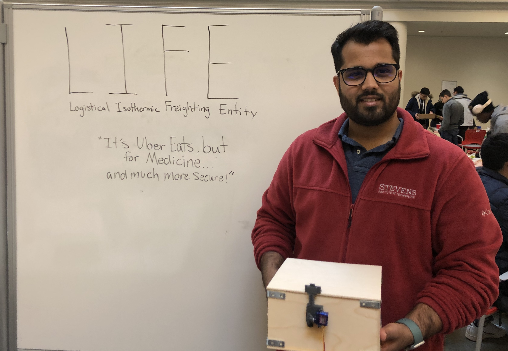
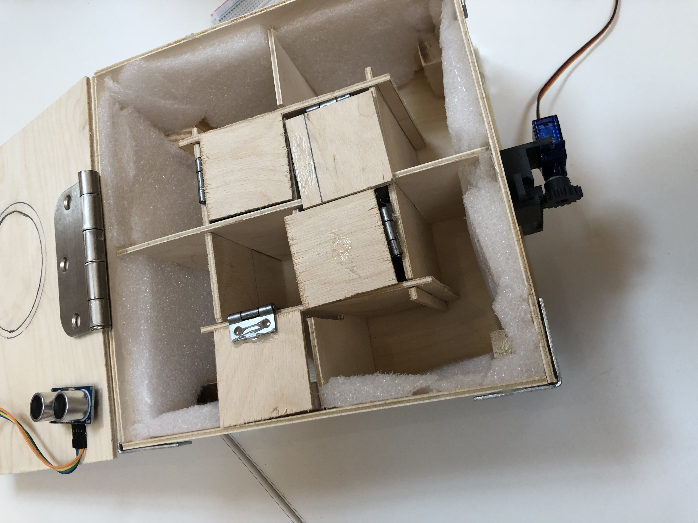
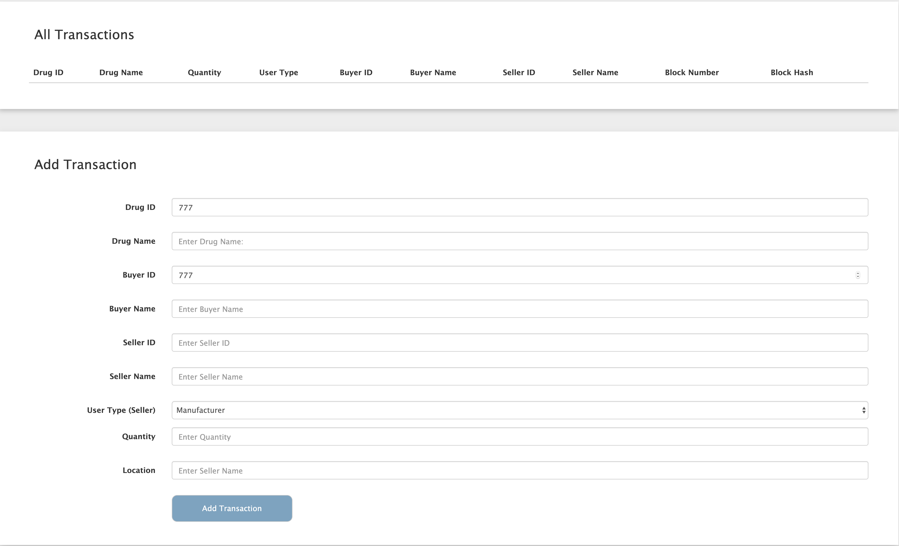
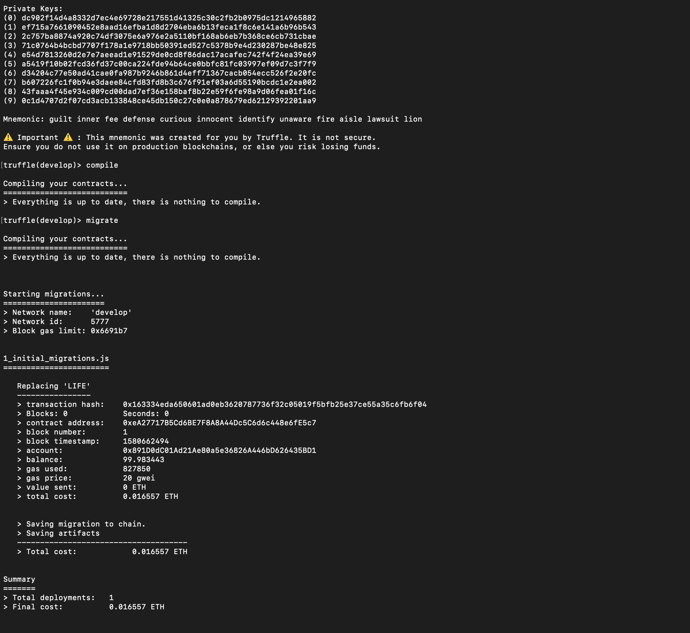

**LIFE - Medicine Delivery System using Blockchain**

Disclaimer: This project was build in 24 hours at a Hackathon in Harvard. Though this is a working prototype; a few components have not been interated together. A new version will be released shortly. Please feel free to report issues or make pull request.

**What it Does**
  
  
 On the hardware side, we built a cooling box that keeps the medication refrigerated. The inner grid was created by putting slits in the wood sheets and interlocking them together. This was done to prevent over constraining the box and to limit the amount of angles and other such materials used. Dry ice packets can be slid into the pockets inside the box, and the separated compartments for medicine keep it, as well as the recipient who retrieves the medicine, safe. We also lined the inside with foam to retain the cold and reduce shock from the bike ride. Since drug safety and security is one of the biggest concerns, we implemented a GPS with an ultrasonic to track the box at all times and to detect possible tampering with the medicine. This would ensure successful transport of the medicine from producer, to hospital, and then to clients. This box can be strapped to a bike or on the back like a backpack! Very eco friendly :)

Pharmacies will need to keep track of where their riders are and the status of their orders, so we programmed a dashboard that contains all the vital information like the prescription authentification and the Biker's location. We see our service becoming the Ubereats for medicine delivery.

Since security is such a huge concern in the medical industry, we partially implemented a blockchain system to create immutable digital records of the prescriptions - like a paper trail :) We also designed a servo lock which is attached to the main lid as a first level of security, and an ultrasonic sensor to detect if the lid was opened.

**Using Blockchain**
  
*The prescription issued by the doctor is securely stored on blockchain making it immutable and highly available. Additionally, the logistical details along with temperature, location and prescription information is stored on blockchain making the entire process - transparent, traceable and highly immune to counterfeiting.*

Devpost - https://devpost.com/software/life-4ds6a1

